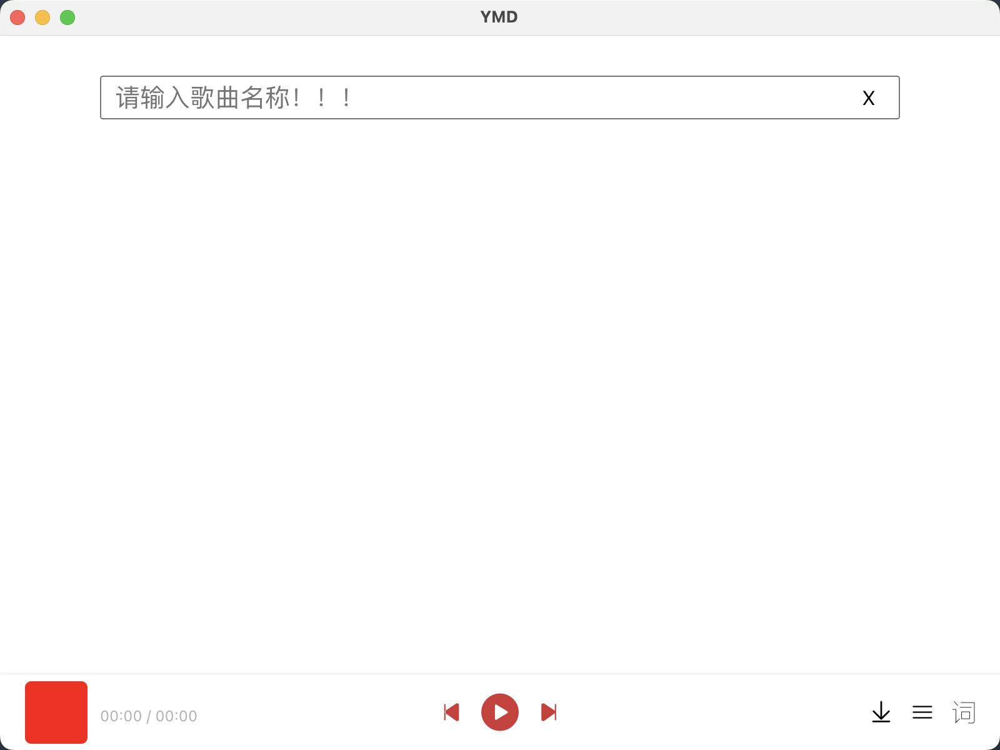
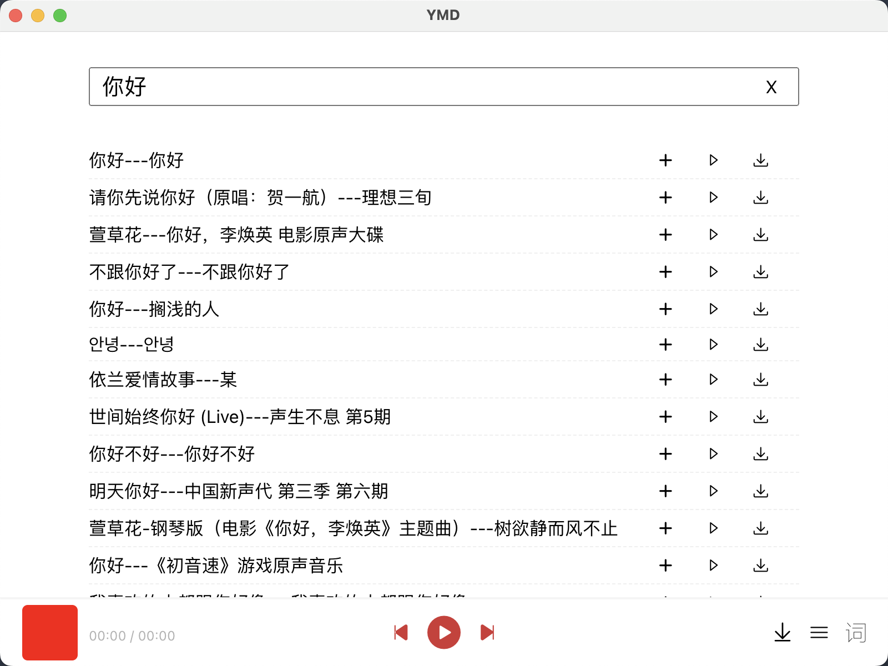
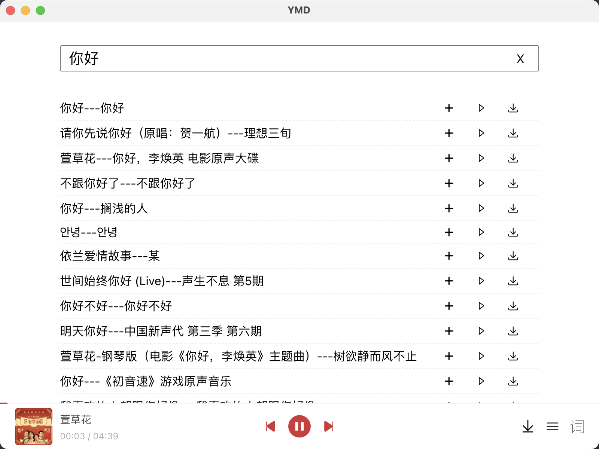
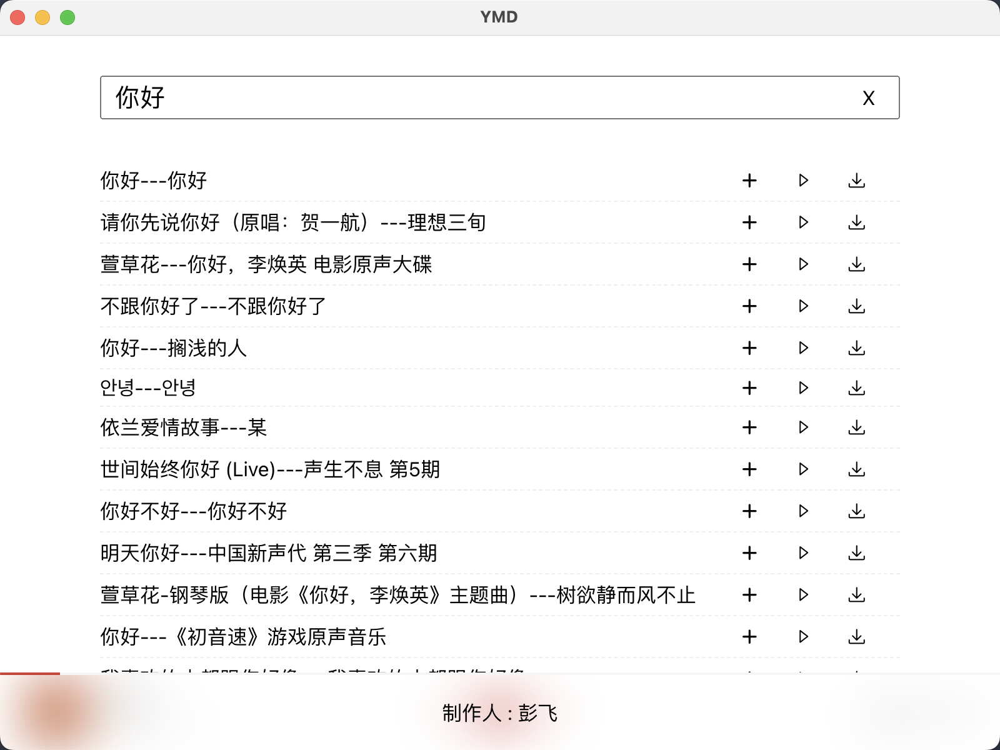
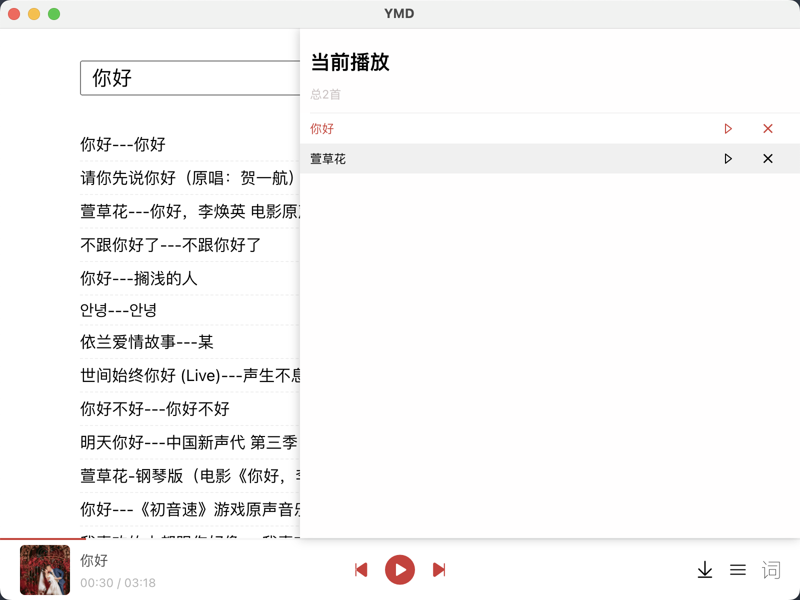
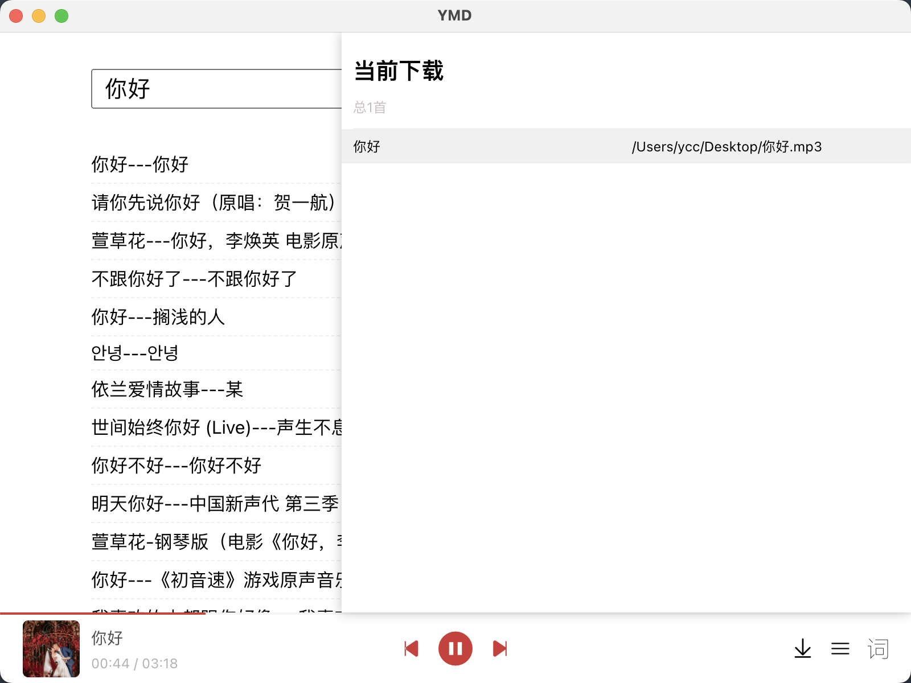

## 简介

ymd一个通过electron，react，nodejs开发的在线音乐播放下载的小工具

## 演示图

## 引用

<ul>
<li><a href="https://github.com/Binaryify/NeteaseCloudMusicApi">在线音乐API参考自NeteaseCloudMusicApi</a></li>
<li><a href="https://github.com/electron-vite/electron-vite-react">项目使用的模版来自vite社区的electron-vite-react</a></li>
</ul>
